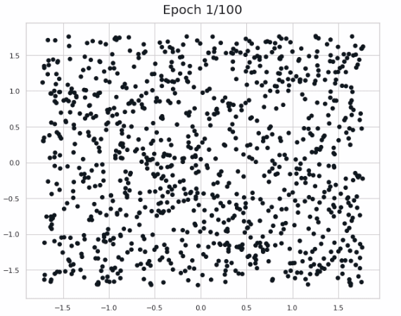

# Mini-project 2 - Mini deep-learning framework

The objective of this project is to design a mini “deep learning framework” using only pytorch’s
tensor operations and the standard math library, hence in particular without using autograd or the
neural-network modules.

## Objective
Import only `torch.empty`, and use no pre-existing neural-network python toolbox. Code should work with autograd globally off.

Framework must provide the necessary tools to:
- build networks combining fully connected layers, Tanh, and ReLU,
- run the forward and backward passes, 
- optimize parameters with SGD for MSE.

Must implement a test executable named `test.py` that imports the framework and
- generates a training and a test set of 1, 000 points sampled uniformly in $[0, 1]^2$, each with a label 0 if outside the disk centered at (0.5, 0.5) of radius $\frac{1}{\sqrt(2 \pi)}$ and 1 inside,
- builds a network with two input units, two output units, three hidden layers of 25 units,
- trains it with MSE, logging the loss,
- computes and prints the final train and the test errors.

## Visualization

## TODOs:
new activation functions can be added

new weight initializations can be added

training pipeline can be improved
